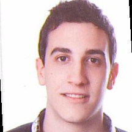

## SERGIO TEJEDA SANCHEZ DE LA MORENA

##### *Actualmente Cursando Full Stack Development en Neoland*  
  

### Formacion:

1. **Grado en Gestión, Contabilidad y Finanzas.**  
Universidad de Valencia.   
*Del 2012 al 2016.*  

2. **Master MBA.**  
Inede Business School. 
*Del 2016 al 2017.*

3. **Full Stack Developer.**  
Neoland.  
*Cursando Actualmente.*

### Experiencia Profesional:

- **Contable Junior.**  
SICA Ingenieria SL.  
*Desde enero 2016 a febrero 2017.*

- **Analista de Riesgos.**  
Workcapital SA.  
*Desde febrero de 2017 a diciembre de 2018.*

- **Contable.**  
Grupo AZA.
*Desde enero 2019 a marzo de 2020.*

| Idioma | Hablado | Escrito |
| --- | --- | --- |
| Castellano | Nativo | Nativo |
| Valenciano | Alto | Medio |
| Ingles | Medio | Alto |

[Linkedin](https://www.linkedin.com/in/sergio-tejeda-s%C3%A1nchez-de-la-morena-1b4b06b2/)
